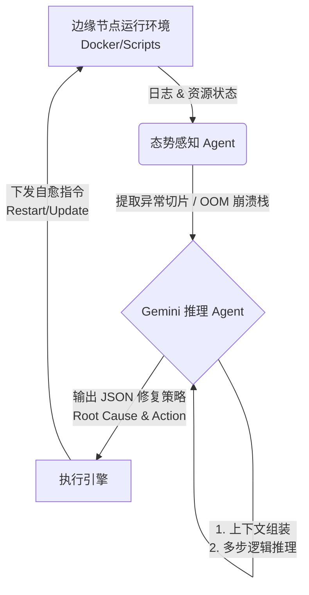

Markdown

# Edge-AI-Ops-Agent

基于多智能体（Multi-Agent）协同架构的轻量级边缘节点自动化运维与智能中枢。专为资源受限的边缘计算设备（如 Armbian NAS、本地化服务器）设计，结合状态感知与 Gemini Pro 的长链推理能力，实现从异常捕获、根因分析到策略下发的全自动闭环系统。

## 核心架构 (Architecture)

系统由感知层、决策层和执行层构成，采用事件驱动模型进行智能体间的高效协同。

##功能特性 (Features)

智能态势感知：实时监控本地容器（如 wxread-auto）及自动化脚本的心跳与资源占用状态。

大模型长链推理：接入 Gemini Pro API，对非结构化崩溃日志（如内存溢出、依赖丢失）进行语义级精准诊断。

全自动故障自愈：将 AI 决策转化为系统级 Shell 指令，实现无人值守的快速故障恢复。

极简部署体验：单文件核心逻辑与无状态设计，支持容器化运行，无缝集成至现有的 CI/CD 或本地 Cron 任务流中。

部署与使用指南 (Deployment)
1. 环境准备
操作系统：Linux / macOS / Windows (推荐 Armbian/Ubuntu)

运行环境：Python 3.10 及以上版本

凭证获取：前往 Google AI Studio 获取免费的 Gemini API Key。

2. 获取代码与依赖安装

Bash

git clone [https://github.com/febpig/Pigzone-AI-Agent-Helper.git]

cd Edge-AI-Ops-Agent
pip install -r requirements.txt

3. 环境配置
复制配置文件模板并填入你的鉴权信息。

Bash

cp .env.example .env
编辑 .env 文件：

程式碼片段

GEMINI_API_KEY="AIzaSyYourApiKeyHere..."
MONITOR_TARGET="wxread-auto"
LOG_PATH="/var/log/containers/"

4. 启动自愈中枢
在终端直接运行主程序，系统将自动进入巡检与分析工作流。

Bash

python edge_ops_agent.py
目录结构 (Structure)
Plaintext

Edge-AI-Ops-Agent/
├── edge_ops_agent.py      # 核心多 Agent 调度运行脚本
├── Dockerfile             # 容器化打包配置
├── requirements.txt       # 运行依赖清单
├── .env.example           # 环境变量声明模板
├── mock_data/             # 本地测试与日志切片库
│   └── wxread_trace.log   # 自动化任务 OOM 崩溃日志示例
└── README.md              # 项目架构与说明文档
